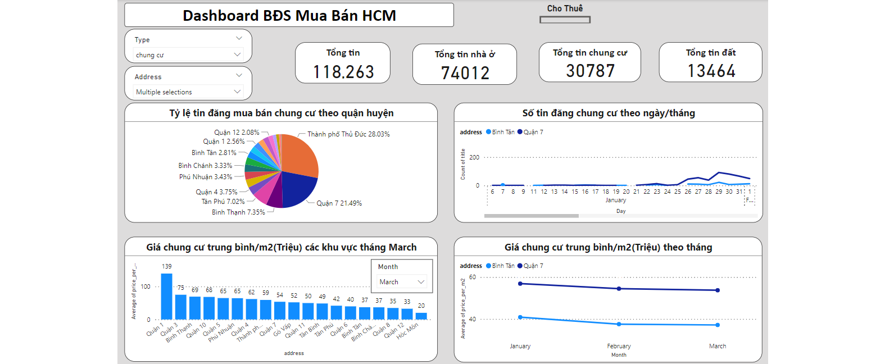

# ETL_Customer_Behavior

## Problem Description
The data engineering project focuses on building a data pipline that analyzes the behavior of users using the service for 1 month. User behavior is what TV shows they watched and how much time they watched
## Architecture

## About Dataset
 - Data is nested data and store in  data lake consist of 30 csv files, each file contains data for 1 day. Shcema of data: 
    - _index: string (nullable = true)
    - _score: long (nullable = true)
    - _source: struct (nullable = true)
        - Appname: string (nullable = true) 
        - Contract: string (nullable = true)
        - Mac: string (nullable = true)
        - TotalDuration: long (nullable = true)
    - _type: string (nullable = true)
  - Data to be searched is contained in the _source field with the format sutruct. After processing data has the following columns::
     - Appname: type of television program 
     - Contract: User code
     - Mac: User's device code
     - TotalDuration: Time spent watching television programs by users
## Main objective
- The following steps were performed to analyze customer behavior in month:
  -  Extract: get raw data from data lake
  -  Transform: Transform data from input to output
  -  Load: save data to data warehoue for analyzes
  -  In Data warehoue, ELT to data mart
  -  Visualzation: create dashboard
## Experiment:
- ETL:
  - Output of the problem: output data has the following columns:
      - Contract: User code
      - MovieDuration: viewing duration of movie programs
      - SportDuration: viewing duration of sport programs
      - ChilDuration: viewing duration of child programs
      - RelaxDuration: viewing duration of Relax programs
      - TvDuration: viewing duration of TV programs
      - TotalDuration :The total viewing duration of all types of TV programs for one user.
      - MostWatch: The type of  program that the user watches the most.
      - Tase: The types of  programs that the user watches.
      - Activeness: The number of days the user uses the service in one month.
      - Date: The date when the ETL process was performed.
- ELT: After having data in the data warehouse, continue to perform ELT to another database within the Data warehouse.
     - Output of the problem: output data has the following columns:
        - Total User:  Total number of users
        - Total_MovieDuration: Total monthly viewing duration of movie programs
        - Total_SportDuration: : Total monthly viewing duration of sport programs
        - Total_ChilDuration: Total monthly viewing duration of child programs
        - Total_RelaxDuration:  Total monthly viewing duration of Relax programs
        - Total_TvDuration: Total monthly viewing duration of TV programs
        - TotalDuraion: Total monthly viewing duration of all programs above
## Technologies  
  - Programing language: Python(pyspark), SQL
  - Data Lake: Hadoop HDFS
  - Data Warehouse: MySQL
  - Data Visualization: Tableau

## Dasboard

