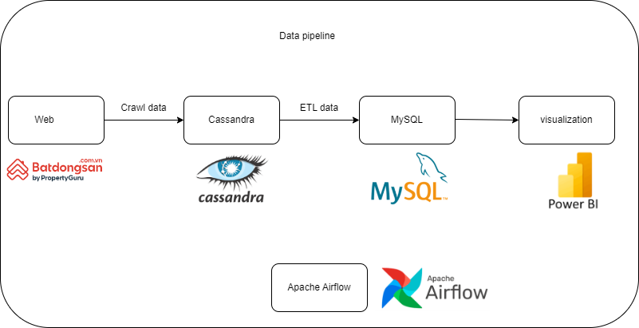

# Real estate analysis in Ho Chi Minh city

## Problem Description
 - This project builds an automated data pipeline to retrieve and process data for analyzing the real estate situation in Ho Chi Minh City during January and February 2024.
## Architecture

## About Dataset
- The data is contained in 2 tables (buy and rent) with the following attributes:
   - id: index
   - address: real estate address
   - area: real estate area
   - bedrooms: number of bedrooms
   - date: posting date
   - price: real estate price
   - price_per_m2: price per square meter of the real estate
   - title: posting content
   - toilets: number of toilets
   - type: type of real estate
   - city:  city
## Main objective
- Use Selenium and BeautifulSoup to crawl real estate data from the website https://batdongsan.com.vn/. Optimize the runtime by implementing multithreading in Selenium.
- Raw data after being retrieved from the web is stored in Cassandra. After processing the data, the data is stored in MySQL for analysis..
- Both the above processes are automated and managed by Apache Airflow. In case of errors in any process, automatic email notifications are sent.
- Analyze the real estate situation in Ho Chi Minh City, identifying areas with high sales and rentals, and comparing price differences.
- Create a dashboard for buying and renting in Ho Chi Minh City.
## Technologies  
  - Programing language: Python(selenium, beautifullsoup,pyspark), SQL
  - Database: MySQL, Cassandra
  - Data Visualization: Tableau

## Dasboard

